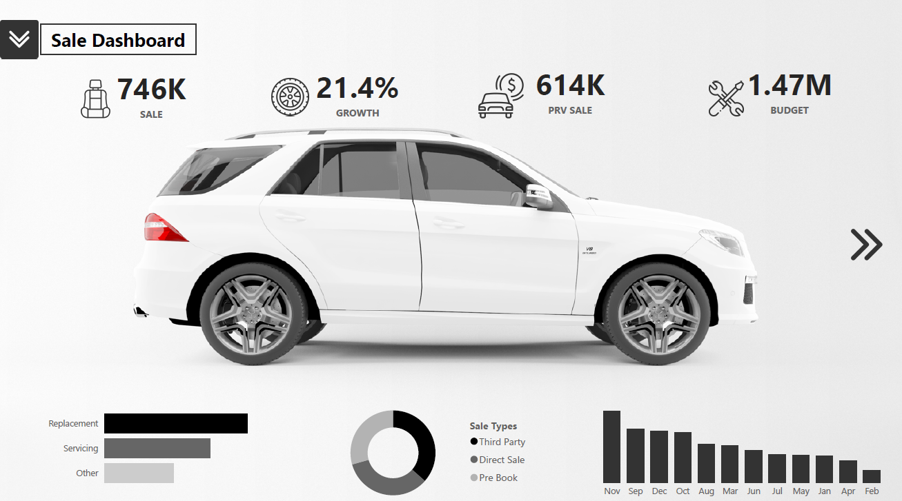
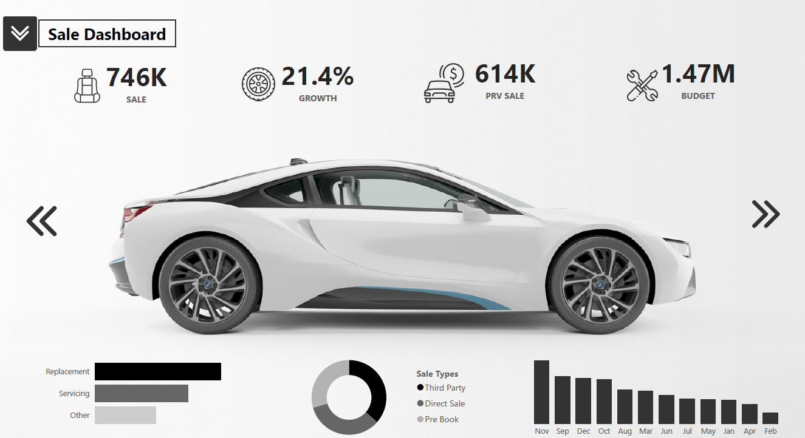
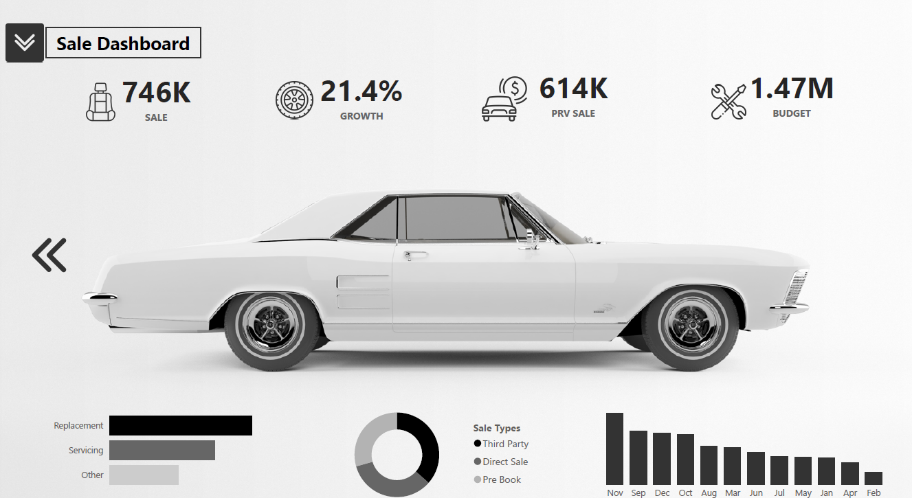
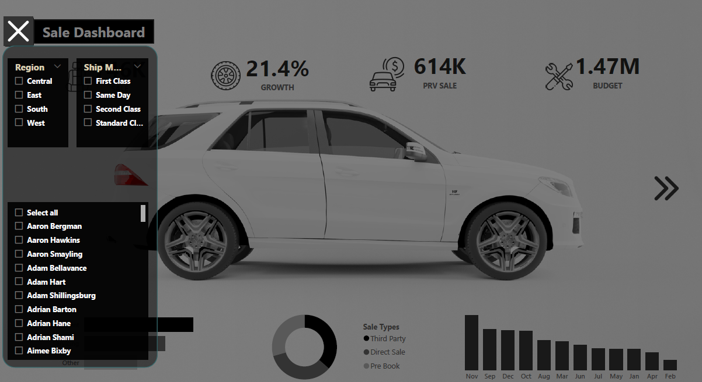

# Car-Themed Power BI Sales Dashboard
Modern Power BI deshboard of mechanical car theme.

## Project Overview
This project presents a visually interactive Car-Themed Sales Dashboard developed in Power BI to analyze total sales performance across products, customers and regions. The dashboard enables stakeholders to monitor revenue, profit and growth trends with the ability to compare current performance against previous periods and allocated budgets. It further assists in operational and strategic decision-making by highlighting sales behavior, customer demand trends and shipment performance.

## Project Purpose / Problem Statement
This dashboard provides a comprehensive analysis of company-wide sales performance across products, customers and regions. It helps stakeholders track total revenue, profit and growth trends while comparing current performance with previous periods and allocated budgets. The dashboard supports strategic decision-making by highlighting sales patterns, customer purchasing behavior and operational metrics such as shipment modes and order fulfillment timelines.

## Dataset Information
The dataset contains transactional sales records, customer details, shipment logistics and product-level information. Key data fields include:	
| **S.No.** | **Column Name**    | **Description**                                                                                   |
|----------|---------------------|---------------------------------------------------------------------------------------------------|
| 1.       | Row ID              | Unique index number assigned to each record in the dataset.                                       |
| 2.       | Order ID            | Unique identification code assigned to each customer order.                                       |
| 3.       | Order Date          | The date on which the customer placed the order.                                                  |
| 4.       | Ship Date           | The date on which the order was shipped to the customer.                                          |
| 5.       | Ship Mode           | The shipping method used for delivery (e.g., Standard, Second Class).                             |
| 6.       | Customer ID         | Unique identifier assigned to each customer.                                                      |
| 7.       | Customer Name       | Full name of the customer placing the order.                                                      |
| 8.       | Segment             | Customer segment classification (Consumer, Corporate, Home Office).                               |
| 9.       | Country/Region      | The country or region where the order was delivered.                                              |
| 10.      | City                | Delivery destination city.                                                                        |
| 11.      | State/Province      | Delivery destination state or province.                                                           |
| 12.      | Postal Code         | ZIP or postal code of the delivery location.                                                      |
| 13.      | Region              | Larger geographical division (e.g., East, West, North, South).                                    |
| 14.      | Product ID          | Unique identifier assigned to each product.                                                       |
| 15.      | Category            | Main product category (e.g., Furniture, Technology, Office Supplies).                             |
| 16.      | Sub-Category        | Subdivision of the product category (e.g., Chairs, Phones, Paper).                                |
| 17.      | Sales               | Total revenue generated from the sale of that product line.                                       |
| 18.      | Quantity            | Number of units sold for the product.                                                             |
| 19.      | Discount            | Discount applied to the sale (expressed as a percentage).                                         |
| 20.      | Profit              | Profit earned after deducting cost and discount.                                                  |

## Data Cleaning / Preprocessing
Performed using Power BI (Power Query):
* Removed duplicate and null records
* Standardized date formats for order and shipment fields
* Created calculated measures for:
 ** Total Sales
 ** Previous Period Sales
 ** Growth %
** Budget Utilization
* Added data model relationships between customer, product and sales tables
* Created DAX measures for KPI cards, trend charts and profit analysis

## Key Insights
* Total sales, profit and growth metrics highlight overall business performance and monthly trends.
* Replacement, servicing and other support categories reflect after-sales service demand.
* Direct Sales, Third-Party Sales and Pre-Book Orders show varied revenue dependency on sales channels.
* Specific product categories and sub-categories contribute disproportionately to revenue and profit.
* Region and city comparisons indicate uneven market penetration and growth opportunities.
* Higher discounts correlate with reduced profit margins.
* Shipment mode performance helps assess delivery efficiency and logistics planning.

## Dashboard Features
* KPI cards highlighting Total Sales, Growth %, Previous Sales and Budget Metrics
* Bar charts comparing Replacement, Servicing and Other service requests
* Sales segmentation by Direct, Third-Party and Pre-Book channels
* Month-wise vertical bar trend for seasonal sales visualization
* Interactive slicers for Region, Shipment Mode, Customer Name and Product Category
* Drill-down navigation: Category → Sub-Category → Product Level
* Profitability analysis with Discount vs Profit relationship
* Fully interactive layout for executive reporting and strategic review

## Download Dashboard File
[Download the Power BI Dashboard (.pbix)](https://github.com/sunilprajapati832/CarDashboard/blob/main/Raw_Car_Dashboard.pbix)  
[Download the Dataset (.xlsx)](https://github.com/sunilprajapati832/CarDashboard/blob/main/Car%20Dashboard%20Source%20(2).xlsx)

## Dashboard Preview

## About Me
I'm Sunil Prajapati — a data analyst, machine learning enthusiast and educational content creator. This project reflects my growth from beginner to practitioner and my passion for turning data into insights.
If you found this project interesting, let’s connect!  

